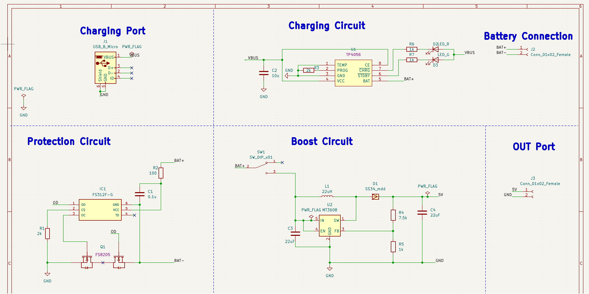
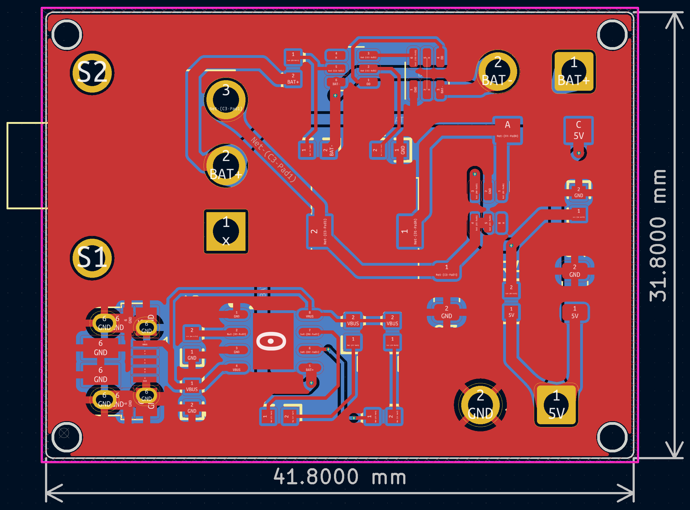
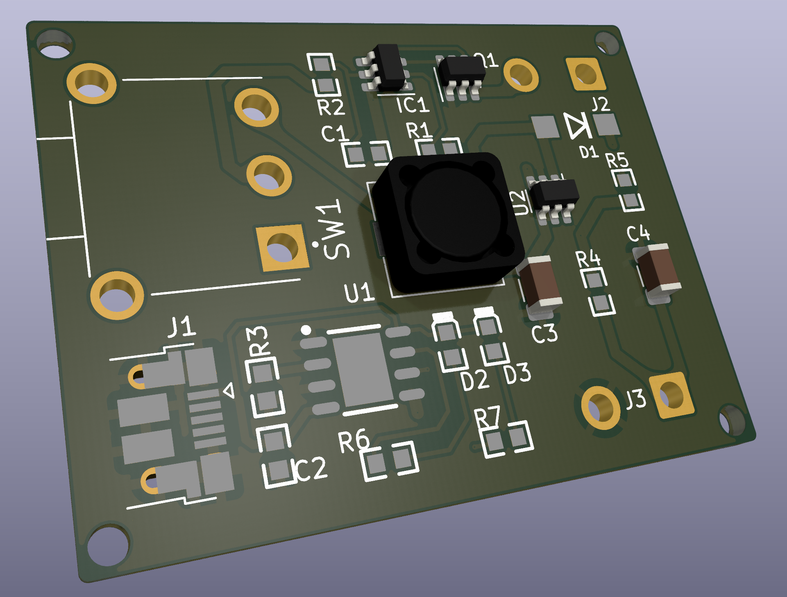
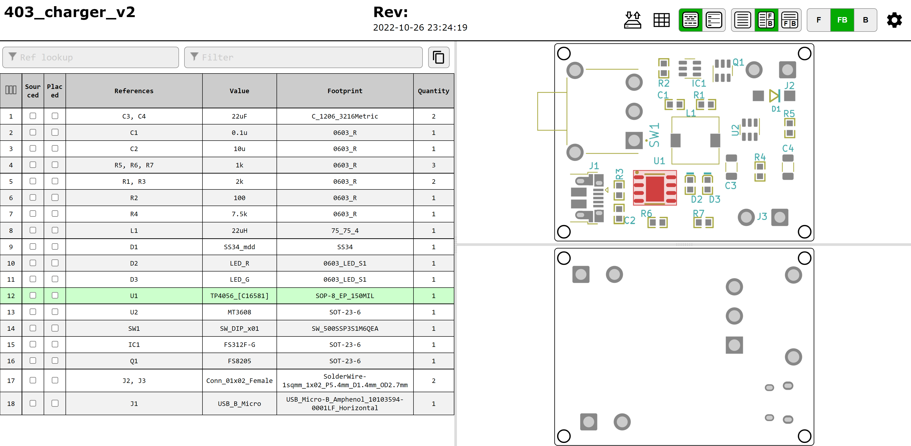

# Power Design Documents
This part illustrates the design of the power associated with the project. There are two KiCAD project folders. One of them is "403_charger_v1," and another one is "403_charger_v2". "403_charger_v1" is the initial design of the power, but it has some problems with the design. "403_charger_v2" is the design that problems got corrected. In the description of the documents, "403_charger_v2" will be focused.   

----
## Description
In the KiCAD project folder, there are three main files, which are "403_charger_v2.kicad_pcb", "403_charger_v2.kicad_pro", "403_charger_v2.kicad_sch". "403_charger_v2.kicad_pcb" is the PCB file of the power. "403_charger_v2.kicad_pro" is the project file of the power. "403_charger_v2.kicad_sch" is the schamatic file of the power. These 3 files can only be opened by the KiCAD.  

----
## Schematic
||
|:--:|
|Schematic Preview of the Power|
The circuit of the power consists of 3 main circuits, which are the charging circuit, the protection cirucit, and the boost cirucit. Details of all components in the schematic will be show below.   

-----
## PCB
|||
|:--:|:--:|
|PCB Preview of the Power|3D Previewof the PCB|

3 different track widths are used in the PCB design. They are 0.250mm, 0.500mm, and 0.750mm. The track of 0.250mm is used to transfer the signals around the chips. The track of 0.500 mm is used to connect pins involved with the output of the battery. The track of 0.750mm is used to be paths involved with boosted output. Additionally, two copper pour planes of GND are on the front and the back.

----
## Bill of Material
|num|References|Value|Footprint|Quantity|Price|
|:--:|:--:|:--:|:--:|:--:|:--:|
|1	    	|C3, C4	    |22uF	    |C_1206_3216Metric  |2|US$1.06|
|2			|C1	        |0.1u	    |0603_R	            |1|US$ 0.0026|
|3			|C2	        |10u	    |0603_R	            |1|US$ 0.0063|
|4			|R5, R6, R7	|1k	        |0603_R	            |3|US$ 0.0033|
|5			|R1, R3	    |2k	        |0603_R             |2|US$ 0.0018|
|6			|R2	        |100	    |0603_R	            |1|US$ 0.0012|
|7			|R4	        |7.5k	    |0603_R	            |1|US$ 0.0013|
|8			|L1	        |22uH	    |75_75_4            |1|US$ 0.1676|
|9			|D1	        |SS34_mdd	|SS34	            |1|US$ 0.0342|
|10			|D2	        |LED_R	    |0603_LED_S1        |1|US$ 0.0381|
|11			|D3	        |LED_G	    |0603_LED_S1        |1|US$ 0.0381|
|12			|U1	        |TP4056_[C16581]	|SOP-8_EP_150MIL    |1|US$ 0.2303|
|13			|U2	        |MT3608	    |SOT-23-6	                |1|US$ 0.1627|
|14			|SW1	    |SW_DIP_x01	        |SW_500SSP3S1M6QEA  |1|US$3.89|
|15			|IC1	    |FS312F-G	        |SOT-23-6   |1|US$ 0.16|
|16			|Q1	        |FS8205             |SOT-23-6   |1|US$ 0.1763|
|17			|J2, J3	    |Conn_01x02_Female	|SolderWire-1sqmm_1x02_P5.4mm_D1.4mm_OD2.7mm    |2|free|
|18	        |J1	        |USB_B_Micro	    |USB_Micro-B_Amphenol_10103594-0001LF_Horizontal|1|free|
There is also another interactive BOM in the files. The path is "403_charger_v2\bom\ibom.html". In the "ibom.html", you can click the component on the PCB then the corresponding information of the component will be highlighted at the side. The following figure is the preview of the interactive BOM.
||
|:--:|
|Preview of the Interactive BOM|

<!-- ## Update History
### 09.13.22 Update
1. The folder, "403_charger_v1", has been uploaded.
2. The 1st version of design has been finished and its draft schematic has been uploaded.  
3. All chips were purchased on 09.05.22. Approximately they will arrive here on 09.19.22.  
4. Next step is going to test these chips and check if the schematic is approachable. If the schematic can work very well, the PCB board will be planned to finish.   
5. The better design is looked for as the alternative case during the waiting time for chips.   

### 09.30.22 Update
1. The footprints of all components have been verified.
2. The routing of the PCB has been finished.
3. BOM file is in the following path: 403_charger_v1/bom/ibom.html.

### 10.03.22 Update
1. Gerber files of the PCB have been ouputed and uploaded.
2. The PCB board has been in the production.

### 10.24.22 Update
1. The folder, "403_charger_v2", has been uploaded.
1. Errors on footprints have been corrected.
2. The spacing and track width have been increased.
3. Four mounting holes have been added into the PCB. -->